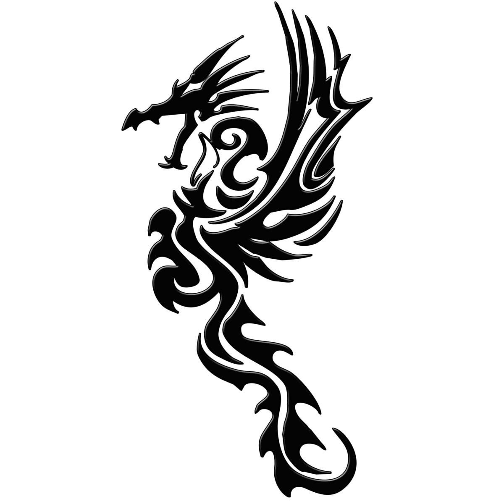
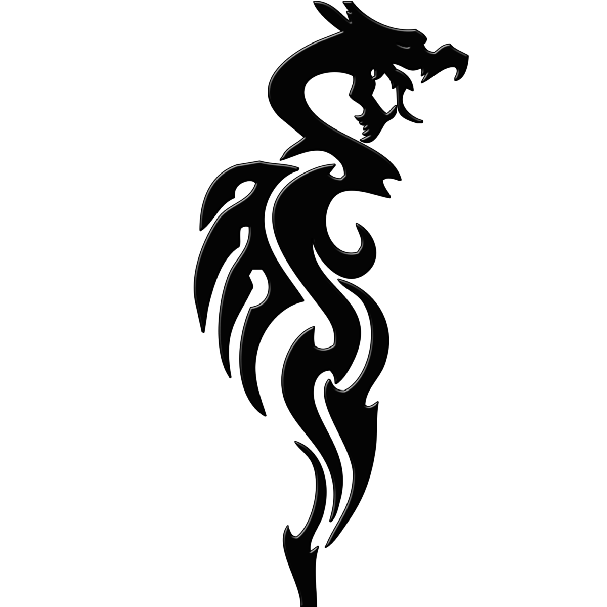
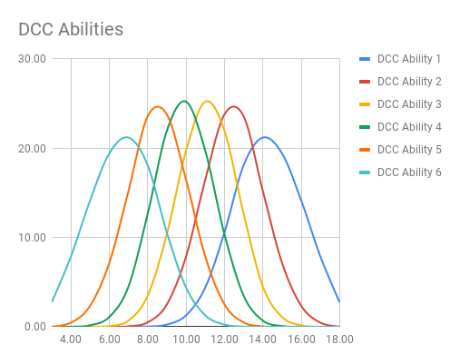
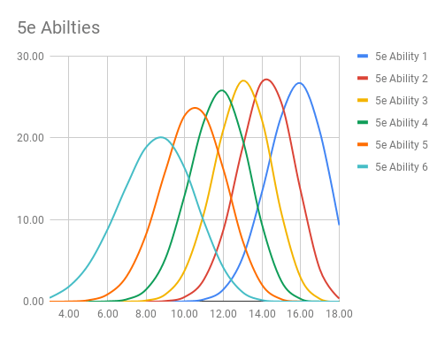
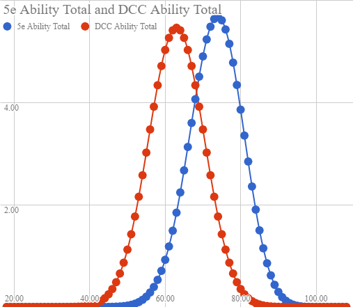

## Earning Your Backstory

So there you are, you’ve finally convinced your friend to play. After all the stories of the adventure and excitement they are ready to dive in, roll dice, kill monsters and loot some treasure! Yet, instead of adventuring you’re fumbling through rules to build a character for 40 minutes. They’re getting bored. What’s all this math?! They quit. This game isn’t fun, it’s just homework.

What if there was another way? Today I’ll explain the logic, and design behind our [5e Background: Legendary Survivor](/blog/5e-background-the-legendary-survivor).

If you’re already convinced, or need to reference the guide quickly check out the [Legendary Survivor]/blog/5e-background-the-legendary-survivor) for a summary of the character creation method.

### The Why

#### A Case For The Randomly Generated Character

##### The Tyranny Of Choice

Freedom of choice is a wonderful thing. Never let anyone deny that.

There is however a phenomenon known as The Tyranny of Choice. Logically having choices should make all the players at the table happier! In small numbers of choices this remains is true, but an abundance of choice leads to misery. This has been proven in scientific research([Scientific America – The Tyranny of Choice by Barry Schwartz](https://www.swarthmore.edu/SocSci/bschwar1/Sci.Amer.pdf)) and trust me it’s been proven anecdotally at my table.

EXCESSIVE choice is a burden. Critical decisions that will live with you for long periods of time, begets more regret than the positive feelings generated by the choices.

We’ve ALL experienced this. You get asked what to arrange your ability scores, what race you want, then class, then ability options, then gear, and then, and then, and then ad nauseum until you’re TIRED of making choices. Maybe you haven’t even played this game before and you have to pick a million things you’re going to be _STUCK_ with?! That’s a lot of potential regret.

I don’t mean to imply that everyone suffers from this when playing 5e, however it is very real for some, particularly new players. They may be overwhelmed by the choices or EVEN WORSE get bored of the game before the _game_ begins due to the long and rules context heavy character creation. I can hear you all, those wise sages who exclaim that a character can be made in no time! Why, you can create one in less than five minutes! Well, yes, YOU can. You also know all the choices, and aren’t really “making” many of the choices at that time, having already subconsciously made those choices before hand.

##### Just Play

What if you could literally roll up characters in about 5 minutes(OR LESS), and start playing right away? What if you could make a single character with literally 2 choices? Now what if those choices were “Name” and “Alignment”? What if… you could never “make the character wrong” in your first game?

What if you sat down **JUST PLAYED** and had an adventure? Sound interesting? Ok, then let’s give it a try.

### The How

So the key difference between 5e and DCCs character creation is that instead of building out your ENTIRE hero, you start with a small set of common folk. Instead of deciding on race, class and background you’re free to _discover_ these things for yourself. Moreover, since you will be starting with a small set of simplified characters, usually about 4, you are now free to make bold decisions and tempt fate from stage one!

So here is a step by step conversion of the initial character creation, what changes in the first adventure (i.e. the zero level ‘funnel’ adventure).

#### The Ability Score Mismatch Challenge

Ability scores, the base core of your character are simple. In DCC they are much the same! Just renames really. Let me show you.

- - -

**The 5e Ability Score**

*   Strength – Smash Doors
*   Constitution – Survive Trap Behind Smashed Door
*   Dexterity – Dodge Smashed Door Bits
*   Intelligence – Understand Door Knob
*   Wisdom – Realizing Door Is Unlocked
*   Charisma – Seduce NPC To Open Door For You

###### And Their DCC Counterpart Ability Score

*   Strength is strength (obvious one here)
*   Constitution is Stamina
*   Dexterity is Agility
*   Intelligence is Intelligence (Another easy one!)
*   Personality is … Charisma? No, it’s a casting ability score for clerics so… Wisdom?
*   And Luck is… oh. Oh dear.

- - -

We found our first hurdle. FEAR NOT, there is a solution. You see the folks over at Goodman Games decided to use different ability scores. THE FOOLS. How dare they! Don’t they realize these ability scores are actually a lot easier to explain to new players!? Erm. Well, anyways, lets go about undoing their good work, because you’re planning to use these characters in 5e!

#### Building the Character

For now, we don’t _need_ to worry about the ability scores mismatch. First we head over to [Get started with DCC](/2019/02/05/starting-out-with-dcc/) and make characters with the standard DCC method . YES this includes rolling 3d6 for each ability score in order, no we don’t skip this, yes trust me we’ll be able to play whatever you want in 5e. We’ll get to the “expected competence level” later

##### Getting the Races Right

Now that you’ve created some characters, you’ll want to add in the possibility that you’re of some of the “rare” races. When, and ONLY when you’ve rolled a human, roll a d12. On a 1-7 the character remains human, but on a 8-12 they are one of the ‘rare’ races (dragonborn, tiefling, gnome, half-orc or half-elf). Each race gets one number, so there is a 1 in 12 chance of any given ‘rare’ race. This works out nicely in making an interesting variety normally present in 5e, but retaining the rare races exotic feel.

##### Expected Competence Level

Of course, _3d6 ability scores_ will never measure up to the _highest 3 of 4d6 ability score_. We can break this down visually by observing the ability distributions.

###### Straight 3d6

A natural bell curve of abilities occurs in the standard DCC method.

###### Highest 3 of 4d6

When we compare the ability scores probability in order we notice that the curves for 5e style ability scores are slightly higher and having a tighter distribution.

###### Distributions of Totaled Ability Scores

As we can see the distribution of **total** ability points is similar, but shifted so that _3d6 ability scores_ are approximately 10 points less than the _highest 3 of 4d6 ability scores_ . The overall curve is reasonably similar, enough so that it would not be game breaking to ignore the curve difference on total ability points.

###### The Fix

These observations can show us our path to designing an ability score conversion. We need the following:

*   A way to close the 10 point ability point total gap.
*   A method of fixing the Ability Score Mismatch. Specifically the lack of Wisdom/Charisma, and the excess Personality/Luck.
*   A way of mitigating punishing low rolls.

We can resolve these issues with three clever steps.

1.  Change Personality into Wisdom OR Charisma (This corrects one missing ability score)
2.  Assign the OTHER missing ability score the value of the current third highest ability score.  
    
3.  Spend each point of Luck to increase any ability score by one point, then remove Luck. The maximum of any ability score is 18 plus any racial modifiers.  
    

> An Example.
> 
> Our character is a Dragonborn with the ability scores are 14; 12; 11; 10; 8; 6. We chose Charisma as our Personality replacement, so we now have an 11 Wisdom. has ability scores are 14; 12; 11; 11; 10; 8 with a 6 Luck. We increase our ability scores by a total of 6, to and end result of 18; 12; 12; 12; 10; 8. We COULD have spent all of our Luck and increased our Strength to 20 due to our +2 racial ability score max, but we decided that our Dragonborn should have three positive modifiers instead.

### Why This Works

Duplicating our third highest ability score closes the gap between DCC ability score totals, and 5e ability score totals. Consulting the table below we can see that the mean ability score total difference between DCC ability scores and 5e ability scores is approximately 10 points. We can ALSO see that the mean score for the third highest DCC score is 11. This means, on average our conversion is ever so slightly better ability score total. This seems fair, as the player will have had to earn this character, and a slight advantage on average is a fair reward. Honestly, no player is going to really notice unless they read this article, because the advantage is so very small that on an individual character it would not be obvious.

Reassigning the points from luck also give the player some customization. In our example we used the WORST case scenario, where luck is the lowest stat and gives us the least customization. This still allows us to have an 18 or higher stat without issue.

| Ability | Mean | Standard Deviation |
| --- | --- | --- |
| DCC System total | 63  | 7.245688373 |
| 5e System total | 73.46759259 | 6.973316268 |
| DCC 1st Highest Ability | 14.23311854 | 1.769333933 |
| DCC 2nd Highest Ability | 12.45330467 | 1.607596575 |
| DCC 3rd Highest Ability | 11.11916922 | 1.549240782 |
| DCC 4th Highest Ability | 9.880830784 | 1.549240782 |
| DCC 5th Highest Ability | 8.546695332 | 1.607596575 |
| DCC 6th Highest Ability | 6.766881459 | 1.769333933 |
| 5e 1st Highest Ability | 15.66188627 | 1.427252688 |
| 5e 2nd Highest Ability | 14.17422788 | 1.43733651 |
| 5e 3rd Highest Ability | 12.95510793 | 1.463966632 |
| 5e 4th Highest Ability | 11.76092951 | 1.529983986 |
| 5e 5th Highest Ability | 10.4113565 | 1.65804591 |
| 5e 6th Highest Ability | 8.504084501 | 1.949020768 |

###### The Worst Case Scenario

Now, let’s presume the “players nightmare” where they want their character to have a class which relies on their second worst ability, and their luck score is their lowest ability. For sake of argument let’s use a stereotypical wizard. The player’s character has an 8 intelligence, and a 6 luck. Since this is a character chosen from 4 other characters it can easily be presumed that their other ability scores are reasonably high in comparison, so we will presume they do not need to improve their other scores. This leaves us with a 14 intelligence, which is perfectly serviceable! Remember that this was the WORST case, which means that the character must have had SOME redeeming characteristic to make it this far.

###### The EVEN Worse Case Scenario

I hear you though, this is a lot of chance and the possibility that the only remaining character is just _garbage_ at the end. Well that’s no fun! I can hear your Judge/Dungeon Master screaming now! “My players would be pissed if they had a character with stats that bad, and I don’t want to have a scrub character in my game!”

Hold on, hold on that is ALSO easily fixed. Remember that Luck can be gained and lost in DCC, and it makes sense that the gods who safeguard adventurers would smile on the wayward soul who sought treasure and glory against all odds. If the character’s new ability total is LESS than 66 they should gain enough Luck to spend to make up the difference. This brings them within one standard deviation of the average power of a normally generated 5e character.
